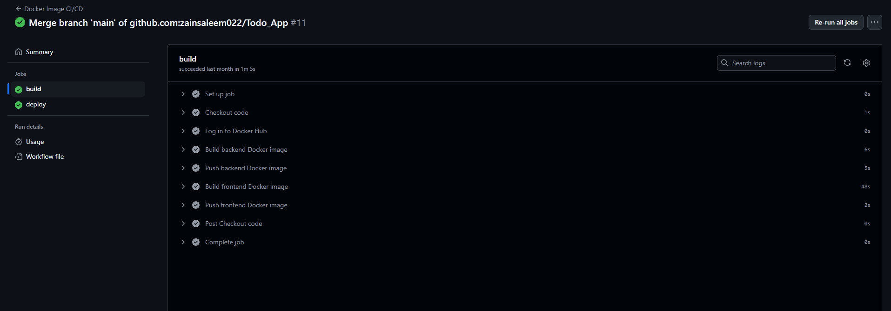
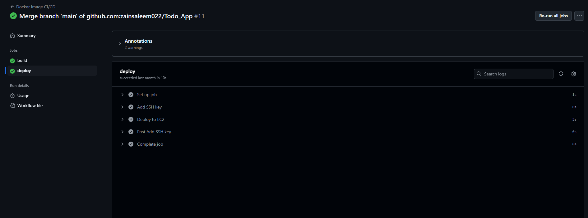

# DevOps-Course-2024 🚀  
Welcome to my DevOps repository! This repository documents my journey through learning DevOps, showcasing projects, summaries, and practical applications of various tools and concepts in the DevOps domain.

---

## Table of Contents
- [Overview](#overview)  
- [Guides and Summaries](#guides-and-summaries-📚)  
  - [MERN Todo App](#mern-todo-app)  
  - [Blogs Summary](#blogs-summary)  
  - [DevOps Learning Outcomes](#devops-learning-outcomes)  
- [Images](#images)  
- [Contact](#contact)  

---

## Overview  
This repository includes project files, learning documentation, and summaries that highlight my skills and understanding of DevOps concepts. It also demonstrates practical implementation and showcases my progress in various tools and technologies.

---

## Guides and Summaries 📚  

### MERN Todo App  
A full-stack MERN application designed to manage tasks efficiently. This project highlights my expertise in building web applications using MongoDB, Express.js, React, and Node.js.

👉 Explore the [MERN Todo App](./MERN_todo_app)  

---

### Blogs Summary  
A collection of concise summaries of blog posts I’ve written, discussing key insights and takeaways related to DevOps.

👉 Read the [Blogs Summary](./Blogs_summary.md)  

---

### DevOps Learning Outcomes  
A comprehensive guide documenting my learning progress in DevOps, including tools, workflows, and methodologies I've mastered.

👉 Read the [DevOps Learning Outcomes](./DevOps_Learning_Outcomes.md)  

---

## Images  
This repository also includes supporting visuals to demonstrate workflows and processes, such as CI/CD pipelines.  

  
  

---

## Contact  
If you have any questions or suggestions, feel free to connect with me:  

- **GitHub**: [zainsaleem022](https://github.com/zainsaleem022)  
- **Email**: [zainsaleem022@gmail.com](mailto:zainsaleem022@gmail.com)  
- **LinkedIn**: [Zain Saleem](https://www.linkedin.com/in/zain-saleem-b052a024a/)  

---
